# Arvis Room Intelligence System — Architecture Document

## 1. Introduction

This document outlines the technical architecture for Arvis, a Raspberry Pi-powered ambient intelligence system for a single bedroom. It serves as the definitive blueprint for development, ensuring consistency across all components.

**Relationship to PRD:** This architecture directly implements the requirements in `docs/prd.md`, with particular focus on:
- Voice-first interaction (Phase 1 priority)
- Event-driven design for extensibility
- Modular components for future feature additions

### Starter Template

**N/A** — This is a greenfield Python project built from scratch. No starter template is used.

### Change Log

| Date | Version | Description | Author |
|------|---------|-------------|--------|
| 2024-11-30 | 1.0 | Initial architecture | Winston (Architect) |

---

## 2. High-Level Architecture

### 2.1 Technical Summary

Arvis is an **event-driven, modular Python application** running on a Raspberry Pi 5. The system uses a central event bus to decouple input sensors (microphone, PIR, camera) from output actuators (speakers, LEDs). Cloud APIs handle speech-to-text, language understanding, and text-to-speech, while local processing handles wake word detection and hardware I/O.

The architecture prioritizes **extensibility** — new intents, scenes, and integrations can be added without modifying core logic.

### 2.2 Architectural Style

| Decision | Choice | Rationale |
|----------|--------|-----------|
| **Architecture** | Event-Driven Monolith | Single process, but loosely coupled via events. Simple deployment to Pi. |
| **Repository** | Monorepo | All code in one repo for easy development |
| **Communication** | Internal Event Bus | Async, decoupled components |
| **External APIs** | REST/HTTP | OpenAI, Spotify, TTS services |

### 2.3 High-Level System Diagram

```mermaid
graph TB
    subgraph Inputs
        MIC[🎤 Microphone]
        PIR[📡 PIR Sensor]
        CAM[📷 Camera]
    end

    subgraph Local Processing
        WW[Wake Word Detector]
        VA[Voice Agent]
        PA[Presence Agent]
        VIA[Vision Agent]
    end

    subgraph Core
        EB[Event Bus]
        IR[Intent Router]
        SM[State Manager]
    end

    subgraph Outputs
        AE[Action Executor]
        LED[💡 LED Controller]
        SPK[🔊 TTS / Speaker]
    end

    subgraph Cloud APIs
        STT[OpenAI Whisper]
        LLM[GPT-4o-mini]
        TTS[TTS Service]
    end

    MIC --> WW
    WW -->|wake detected| VA
    VA -->|audio| STT
    STT -->|text| LLM
    LLM -->|intent JSON| IR

    PIR --> PA
    CAM --> VIA

    PA -->|events| EB
    VIA -->|events| EB
    VA -->|events| EB

    EB --> IR
    IR --> SM
    SM --> AE

    AE --> LED
    AE --> TTS
    TTS --> SPK
```



### 2.4 Core Architectural Patterns

| Pattern | Description | Rationale |
|---------|-------------|-----------|
| **Event-Driven** | Components communicate via events on a central bus | Decoupling, extensibility, async processing |
| **Intent-Based Actions** | Voice/sensor inputs → intents → actions | Clean separation, easy to add new commands |
| **State Machine** | Room state (EMPTY/OCCUPIED/SLEEP/WAKE) drives behavior | Predictable transitions, conflict resolution |
| **Plugin Architecture** | Intent handlers registered dynamically | Easy to add new capabilities |
| **Dependency Injection** | Components receive dependencies at init | Testability, mock hardware in dev |

---

## 3. Tech Stack

### 3.1 Runtime Environment

| Environment | Details |
|-------------|---------|
| **Development** | macOS (no hardware, mocked sensors) |
| **Production** | Raspberry Pi 5 (8GB), Raspberry Pi OS |

### 3.2 Technology Stack

| Category | Technology | Version | Purpose | Rationale |
|----------|------------|---------|---------|-----------|
| **Language** | Python | 3.11+ | Primary language | Pi support, rich ecosystem, team familiarity |
| **Async** | asyncio | stdlib | Async event loop | Native Python, no deps |
| **Audio Capture** | sounddevice | 0.4.6 | Mic input | Cross-platform, numpy integration |
| **Audio Playback** | pygame.mixer | 2.5+ | TTS/FX playback | Reliable, low-latency |
| **Wake Word** | Porcupine | 3.0+ | Local wake word | Low CPU, custom wake words, free tier |
| **Wake Sensitivity** | 0.5 | — | Balanced detection | Default, good balance of accuracy vs false positives |
| **STT** | OpenAI Whisper API | latest | Speech-to-text | Best accuracy, simple API |
| **LLM** | OpenAI GPT-4o-mini | latest | Intent extraction | Cost-effective, fast |
| **TTS** | OpenAI TTS | latest | Voice responses | Natural voice, simple API |
| **TTS Voice** | "onyx" | — | Deep, calm male voice | Matches Arvis minimal personality |
| **HTTP Client** | httpx | 0.25+ | API calls | Async support, modern |
| **GPIO** | gpiozero | 2.0+ | PIR sensor | Pythonic, easy to use |
| **Camera** | OpenCV | 4.8+ | Video capture | Industry standard |
| **Pose Detection** | MediaPipe | 0.10+ | Posture estimation | Google, optimized for edge |
| **LED Control** | rpi_ws281x | 5.0+ | WS2812B LEDs | Direct Pi control |
| **LED Strip** | LOAMLIN WS2812B | 5m/300LED | 60 LED/m, IP30, 5V | [Amazon](https://www.amazon.com/dp/B09573HX4X) |
| **LED Power** | 5V 10A PSU | — | Powers LED strip | Required, not included with strip |
| **Smart Plug Control** | python-kasa | 0.5+ | Kasa device control | Local network API |
| **Smart Desk Control** | requests/paho-mqtt | — | Standing desk automation | HTTP/MQTT APIs |
| **Config** | python-dotenv | 1.0+ | Environment vars | Simple, secure |
| **Logging** | loguru | 0.7+ | Structured logging | Beautiful, easy |
| **Scheduling** | schedule | 1.2+ | Timers, alarms | Lightweight |

### 3.3 External APIs

| Service | Purpose | Auth Method |
|---------|---------|-------------|
| OpenAI API | STT, LLM, TTS | API Key |
| Spotify API | Music control (Phase 5) | OAuth 2.0 |

---

## 4. Data Models

### 4.1 Room State

```python
class RoomState(Enum):
    EMPTY = "empty"           # No one in room
    OCCUPIED = "occupied"     # Someone present, awake
    SLEEP = "sleep"           # User sleeping
    WAKE = "wake"             # Alarm active, waking up
```

### 4.2 Event Model

```python
@dataclass
class Event:
    type: str                 # e.g., "presence.motion_detected"
    payload: dict             # Event-specific data
    timestamp: datetime       # When event occurred
    source: str               # Which agent produced it
```

**Event Types:**
| Event | Payload | Source |
|-------|---------|--------|
| `wake_word.detected` | `{}` | Wake Word Detector |
| `voice.command` | `{text: str, confidence: float}` | Voice Agent |
| `presence.motion` | `{}` | Presence Agent |
| `presence.timeout` | `{minutes: int}` | Presence Agent |
| `vision.posture` | `{posture: str, zone: str}` | Vision Agent |
| `vision.bed_exit` | `{}` | Vision Agent |
| `alarm.trigger` | `{alarm_id: str}` | Scheduler |

### 4.3 Intent Model

```python
@dataclass
class Intent:
    action: str               # e.g., "lights.set_scene"
    params: dict              # Action-specific parameters
    priority: int             # Higher = more important
    source: str               # What generated this intent
```

**Intent Types:**
| Intent | Params | Example |
|--------|--------|---------|
| `lights.on` | `{}` | Turn lights on |
| `lights.off` | `{}` | Turn lights off |
| `lights.scene` | `{scene: str}` | `{scene: "focus"}` |
| `lights.animate` | `{animation: str, duration: float}` | `{animation: "golden_shimmer"}` |
| `device.on` | `{device: str}` | `{device: "record_player"}` |
| `device.off` | `{device: str}` | `{device: "record_player"}` |
| `device.status` | `{device: str}` | `{device: "record_player"}` |
| `desk.move_up` | `{distance: float}` | `{distance: 5.0}` |
| `desk.move_down` | `{distance: float}` | `{distance: 5.0}` |
| `desk.set_height` | `{height: float}` | `{height: 120.0}` |
| `desk.set_preset` | `{preset: str}` | `{preset: "standing"}` |
| `desk.get_height` | `{}` | Current height query |
| `audio.say` | `{text: str}` | `{text: "Welcome back, Arman"}` |
| `room.set_state` | `{state: RoomState}` | `{state: "sleep"}` |
| `alarm.start` | `{alarm_id: str}` | Start alarm |
| `alarm.stop` | `{}` | Stop alarm |
| `timer.set` | `{minutes: int}` | `{minutes: 10}` |

### 4.4 Scene Model

```python
@dataclass
class Scene:
    id: str                   # e.g., "welcome", "focus"
    lights: LightConfig       # LED settings
    voice: Optional[str]      # TTS message
    animation: Optional[str]  # LED animation name
```

---

## 5. Component Architecture

### 5.1 Component Overview


### 5.2 Component Details

#### **EventBus**
- **Responsibility:** Central pub/sub system for all events
- **Key Interfaces:** `publish(event)`, `subscribe(event_type, handler)`
- **Dependencies:** None (core infrastructure)
- **Pattern:** Observer pattern with async handlers

#### **WakeWordDetector**
- **Responsibility:** Always-listening for "Arvis" wake word
- **Key Interfaces:** `start()`, `stop()`, `on_wake_word(callback)`
- **Dependencies:** Porcupine SDK, microphone
- **Output Events:** `wake_word.detected`

#### **VoiceAgent**
- **Responsibility:** Record speech, transcribe, extract intent
- **Key Interfaces:** `process_command()` 
- **Dependencies:** STTBackend, LLMBackend, AudioController
- **Output Events:** `voice.command`

#### **PresenceAgent**
- **Responsibility:** Track room occupancy via PIR
- **Key Interfaces:** `start()`, `get_state()`
- **Dependencies:** GPIO (PIR sensor)
- **Output Events:** `presence.motion`, `presence.timeout`
- **Configuration:** 
  - `PIR_TIMEOUT_MINUTES = 10` — minutes of no motion before EMPTY state

#### **VisionAgent**
- **Responsibility:** Posture detection, zone tracking, sleep detection
- **Key Interfaces:** `start()`, `get_posture()`, `get_zone()`
- **Dependencies:** OpenCV, MediaPipe
- **Output Events:** `vision.posture`, `vision.bed_exit`

#### **IntentRouter**
- **Responsibility:** Convert events to intents, apply priority rules
- **Key Interfaces:** `route(event) -> List[Intent]`
- **Dependencies:** StateManager, intent handlers (plugins)
- **Priority Rules:**
  1. Voice commands override automatic transitions
  2. Alarm stop requires physical action (bed exit)
  3. Manual scene > automatic scene

#### **StateManager**
- **Responsibility:** Maintain room state, enforce transitions
- **Key Interfaces:** `get_state()`, `set_state(state)`, `can_transition(from, to)`
- **Dependencies:** EventBus (publishes state changes)

#### **ActionExecutor**
- **Responsibility:** Execute intents via appropriate controllers
- **Key Interfaces:** `execute(intent)`
- **Dependencies:** LEDController, AudioController
- **Pattern:** Command pattern, plugin-based handlers

#### **LEDController**
- **Responsibility:** Control WS2812B LED strips
- **Key Interfaces:** `set_color(r,g,b)`, `set_scene(scene)`, `animate(animation)`
- **Dependencies:** rpi_ws281x library
- **Animations:** golden_shimmer, fade_in, fade_out, sunrise

#### **AudioController**
- **Responsibility:** Play TTS and sound effects
- **Key Interfaces:** `say(text)`, `play_sound(sound_id)`
- **Dependencies:** TTSBackend, pygame.mixer

#### **SmartPlugController**
- **Responsibility:** Control TP-Link Kasa smart plugs via local network
- **Key Interfaces:** `turn_on(device_id)`, `turn_off(device_id)`, `is_on(device_id)`, `get_energy_usage(device_id)`
- **Dependencies:** python-kasa library
- **Discovery:** Auto-discovers Kasa devices on network startup via UDP broadcast
- **Device Mapping:** Normalizes Kasa app aliases to device IDs (e.g., "Record Player" → "record_player")

#### **STTBackend**
- **Responsibility:** Transcribe audio to text
- **Key Interfaces:** `transcribe(audio_bytes) -> str`
- **Dependencies:** OpenAI Whisper API

#### **LLMBackend**
- **Responsibility:** Extract intent from natural language
- **Key Interfaces:** `extract_intent(text) -> Intent`
- **Dependencies:** OpenAI GPT API
- **Prompt:** Structured to return JSON intent

#### **TTSBackend**
- **Responsibility:** Convert text to speech audio
- **Key Interfaces:** `synthesize(text) -> audio_bytes`
- **Dependencies:** OpenAI TTS API

---

## 6. Core Workflows

### 6.1 Voice Command Flow


### 6.2 Room Entry Flow


### 6.3 Sleep Detection Flow


### 6.4 Alarm Wake Flow


---

## 7. External APIs

### 7.1 OpenAI API

- **Purpose:** STT, LLM intent extraction, TTS
- **Documentation:** https://platform.openai.com/docs
- **Base URL:** `https://api.openai.com/v1`
- **Authentication:** Bearer token (API key)
- **Rate Limits:** Tier-based, monitor usage

**Endpoints Used:**

| Method | Endpoint | Purpose |
|--------|----------|---------|
| POST | `/audio/transcriptions` | Whisper STT |
| POST | `/chat/completions` | GPT intent extraction |
| POST | `/audio/speech` | TTS synthesis |

### 7.2 Picovoice (Porcupine)

- **Purpose:** Local wake word detection
- **Documentation:** https://picovoice.ai/docs/porcupine/
- **Authentication:** Access key (free tier available)
- **Runs locally:** No network required after init

---

## 8. Source Tree

```
arvis/
├── src/
│   ├── __init__.py
│   ├── main.py                    # Entrypoint, orchestration
│   ├── config.py                  # Configuration, env vars
│   │
│   ├── core/
│   │   ├── __init__.py
│   │   ├── event_bus.py           # Pub/sub event system
│   │   ├── intent_router.py       # Event → Intent routing
│   │   ├── state_manager.py       # Room state machine
│   │   ├── action_executor.py     # Intent execution
│   │   └── models.py              # Event, Intent, Scene dataclasses
│   │
│   ├── agents/
│   │   ├── __init__.py
│   │   ├── wake_word.py           # Porcupine wake word
│   │   ├── voice_agent.py         # Voice command processing
│   │   ├── presence_agent.py      # PIR sensor handling
│   │   └── vision_agent.py        # Camera + pose detection
│   │
│   ├── backends/
│   │   ├── __init__.py
│   │   ├── stt_backend.py         # OpenAI Whisper
│   │   ├── llm_backend.py         # GPT intent extraction
│   │   └── tts_backend.py         # OpenAI TTS
│   │
│   ├── controllers/
│   │   ├── __init__.py
│   │   ├── led_controller.py      # WS2812B control
│   │   ├── audio_controller.py    # TTS playback, sound FX
│   │   ├── smart_plug_controller.py  # Kasa smart plug control
│   │   └── animations.py          # LED animation definitions
│   │
│   ├── intents/
│   │   ├── __init__.py
│   │   ├── lights.py              # Light-related intent handlers
│   │   ├── devices.py              # Smart plug device intent handlers
│   │   ├── audio.py               # Audio intent handlers
│   │   ├── room.py                # Room state handlers
│   │   ├── alarm.py               # Alarm handlers
│   │   └── timer.py               # Timer handlers
│   │
│   └── utils/
│       ├── __init__.py
│       ├── audio_utils.py         # Audio recording helpers
│       └── time_utils.py          # Time-aware greetings, etc.
│
├── assets/
│   └── sounds/                    # Local sound effects
│
├── tests/
│   ├── __init__.py
│   ├── conftest.py                # Pytest fixtures
│   ├── test_event_bus.py
│   ├── test_intent_router.py
│   ├── test_state_manager.py
│   └── mocks/
│       ├── mock_gpio.py           # Mock PIR sensor
│       ├── mock_camera.py         # Mock vision
│       └── mock_led.py            # Mock LED strip
│
├── docs/
│   ├── prd.md
│   ├── architecture.md
│   └── ...
│
├── .env.example
├── .gitignore
├── requirements.txt
├── README.md
└── pyproject.toml
```

---

## 9. Extensibility Patterns

### 9.1 Adding New Intent Handlers

Intent handlers are registered as plugins:

```python
# src/intents/timer.py
from core.action_executor import register_handler

@register_handler("timer.set")
async def handle_timer_set(intent: Intent, ctx: Context):
    minutes = intent.params["minutes"]
    await ctx.scheduler.set_timer(minutes)
    await ctx.audio.say(f"Timer set for {minutes} minutes.")
```

### 9.2 Adding New Scenes

Scenes are defined in config:

```python
# config.py
SCENES = {
    "welcome": Scene(
        id="welcome",
        lights=LightConfig(color="#FFD700", brightness=0.7),
        animation="golden_shimmer",
        voice="Welcome back, Arman."
    ),
    "focus": Scene(
        id="focus",
        lights=LightConfig(color="#FFFFFF", brightness=1.0),
        voice="Focus mode."
    ),
    # Easy to add more...
}
```

### 9.3 Adding New Event Sources

New sensors publish to the same event bus:

```python
# Example: Adding a temperature sensor
class TemperatureAgent:
    def __init__(self, event_bus: EventBus):
        self.event_bus = event_bus
    
    async def on_temperature_change(self, temp: float):
        await self.event_bus.publish(Event(
            type="environment.temperature",
            payload={"celsius": temp}
        ))
```

### 9.4 Adding New LLM Commands

The LLM prompt is structured to recognize new command categories:

```python
# backends/llm_backend.py
SYSTEM_PROMPT = """
You extract user intent from voice commands for a room assistant.

Return JSON with action and params. Known actions:
- lights.on, lights.off, lights.scene
- timer.set (params: minutes)
- alarm.set (params: time)
- status.get
- [ADD NEW ACTIONS HERE]

If unclear, return {action: "clarify", params: {question: "..."}}
"""
```

---

## 10. Error Handling

### 10.1 General Approach

| Error Type | Handling | User Feedback |
|------------|----------|---------------|
| Network failure | Retry once silently, then announce | "I'm offline." |
| API error | Log, fallback if available | "Something went wrong." |
| Hardware error | Log, continue with degraded mode | (silent, log only) |
| Intent unclear | Ask LLM for clarification | "I didn't catch that." |

### 10.2 Logging Standards

```python
from loguru import logger

# Configuration
logger.add("logs/arvis.log", rotation="1 day", retention="7 days")

# Usage
logger.info("Voice command received", text=text)
logger.error("API call failed", service="openai", error=str(e))
```

### 10.3 Circuit Breaker for APIs

```python
# If API fails 3x in 60 seconds, stop trying for 5 minutes
API_CIRCUIT_BREAKER = CircuitBreaker(
    failure_threshold=3,
    recovery_timeout=300,
    expected_exceptions=[httpx.TimeoutException, httpx.HTTPStatusError]
)
```

---

## 11. Coding Standards

### 11.1 Core Standards

| Item | Standard |
|------|----------|
| **Python Version** | 3.11+ |
| **Style** | PEP 8, enforced by `ruff` |
| **Type Hints** | Required for all public functions |
| **Async** | Use `async/await` for I/O operations |
| **Tests** | pytest, file convention: `test_*.py` |

### 11.2 Critical Rules

1. **Never block the event loop** — All I/O must be async or run in thread pool
2. **No hardcoded secrets** — Use environment variables via `config.py`
3. **Log, don't print** — Use `loguru` logger, never `print()`
4. **Events are immutable** — Never modify an event after creation
5. **Intents are stateless** — All context passed as parameters
6. **Mock hardware in tests** — Use dependency injection for testability

### 11.3 Naming Conventions

| Element | Convention | Example |
|---------|------------|---------|
| Modules | snake_case | `voice_agent.py` |
| Classes | PascalCase | `VoiceAgent` |
| Functions | snake_case | `process_command()` |
| Constants | UPPER_SNAKE | `ROOM_EMPTY_TIMEOUT` |
| Events | dot.notation | `presence.motion_detected` |
| Intents | dot.notation | `lights.set_scene` |

---

## 12. Testing Strategy

### 12.1 Test Types

| Type | Coverage | Tools |
|------|----------|-------|
| Unit | Core logic, intent handlers | pytest, pytest-asyncio |
| Integration | Event flows, state transitions | pytest, mocks |
| Hardware | Manual on Pi | Debug CLI mode |

### 12.2 Mocking Strategy

```python
# tests/conftest.py
@pytest.fixture
def mock_event_bus():
    return MockEventBus()

@pytest.fixture
def mock_led_controller():
    return MockLEDController()

@pytest.fixture
def action_executor(mock_led_controller, mock_audio_controller):
    return ActionExecutor(
        led=mock_led_controller,
        audio=mock_audio_controller
    )
```

### 12.3 Debug CLI Mode

For manual testing without hardware:

```bash
python -m src.main --debug-cli
> event presence.motion
[StateManager] State: EMPTY → OCCUPIED
[LEDController] animate(golden_shimmer)
[AudioController] say("Welcome back, Arman")

> intent lights.scene focus
[LEDController] set_scene(focus)
[AudioController] say("Focus mode.")
```

---

## 13. Deployment

### 13.1 Development Environment (macOS)

```bash
# Setup
python -m venv .venv
source .venv/bin/activate
pip install -r requirements.txt
cp .env.example .env  # Add API keys

# Run (mocked hardware)
python -m src.main --mock-hardware
```

### 13.2 Production Environment (Raspberry Pi)

```bash
# Setup
sudo apt update
sudo apt install python3.11 python3.11-venv portaudio19-dev
python3.11 -m venv .venv
source .venv/bin/activate
pip install -r requirements.txt

# Run as service
sudo cp arvis.service /etc/systemd/system/
sudo systemctl enable arvis
sudo systemctl start arvis
```

### 13.3 Environment Variables

```bash
# .env
OPENAI_API_KEY=sk-...
PORCUPINE_ACCESS_KEY=...
ARVIS_DEBUG=false
ARVIS_MOCK_HARDWARE=false
```

---

## 14. Security

### 14.1 API Keys

- Stored in `.env`, never committed
- Loaded via `python-dotenv`
- Never logged or exposed in errors

### 14.2 Privacy

- No camera frames stored (only derived state)
- No audio stored (only transcripts if debug enabled)
- All processing local except API calls

### 14.3 Network

- Outbound HTTPS only
- No inbound ports exposed
- No remote access by default

---

## 15. Next Steps

1. **Implement Phase 1** — Voice loop (wake word → STT → LLM → TTS)
2. **Create skeleton modules** — EventBus, IntentRouter, StateManager
3. **Set up development environment** — macOS with mocked hardware
4. **Integrate Porcupine** — Wake word detection
5. **Integrate OpenAI APIs** — STT, LLM, TTS
6. **Test voice flow end-to-end**

---

## Appendix A: LLM Intent Extraction Prompt

```
You are Arvis, a room assistant. Extract the user's intent from their voice command.

Current room state: {state}
Current time: {time}

Return a JSON object with:
- action: the intent action (e.g., "lights.on", "lights.scene", "timer.set")
- params: action-specific parameters

Known actions:
- lights.on, lights.off
- lights.scene (params: scene = "focus" | "night" | "wake")
- timer.set (params: minutes)
- alarm.set (params: time in HH:MM)
- alarm.stop
- status.get
- room.cancel_sleep (when user says "I'm still awake")

If you cannot understand the command, return:
{action: "clarify", params: {message: "I didn't catch that."}}

User said: "{text}"
```

---

*Architecture document generated by Winston, BMAD Architect Agent*

